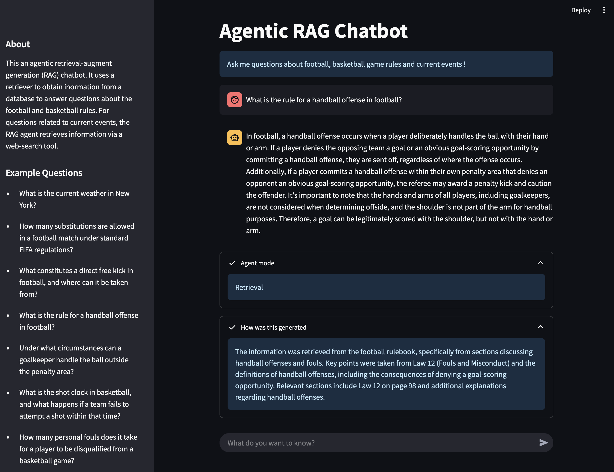

# Agentic-RAG-chatbot

This an agentic retrieval-augment generation (RAG) chatbot. It uses a retriever to obtain infromation from a database to answer questions related to football and basketball rules. For questions related to current events, the RAG agent retrieves information via a web-search tool.

## How to Use

-  Ask the chatbot questions related to football and basketball rules, and recents events.


## Look and Feel



## Application Setup
Follow the instructions below within the screen terminal:

- Clone the repository 

- Change directory into the cloned (or downloaded) **agent_RAG_Chatbot** folder and create a virtual environment. Run the following:
    ```
    python3 -m venv venv  # create virtual environment
    source venv/bin/activate  # on Windows: venv\Scripts\activate
    python3 -m pip install --upgrade pip setuptools wheel
    ```

- install `requirements.txt` file.
    ```
    pip install -r requirements.txt
    ```

- run `create_vectorstore.py` to create a vector store database named **vectorstore_db**. In this scenario, the vector store database has been created using the files in the data folder
    ```
    python create_vectorestore.py
    ```
- Add your OPENAI api key in the `secrets.toml` file contained in the **.streamlit** folder.

    ```
    OPENAI_API_KEY = "YOUR_OPENAI_API_KEY"
    ```

- Launch the chatbot application

    ```
    streamlit run ragChatbot_app.py
    ```

## Customization
You can add any file(s) of your choices into the `data` folder. The format of the file(s) must be in PDF. For this project, two files have been added ("FIBA_rules_2024.pdf, FIFA_rules_21_22.pdf"). These are the files were used to create a vector store database for information retrieval. 